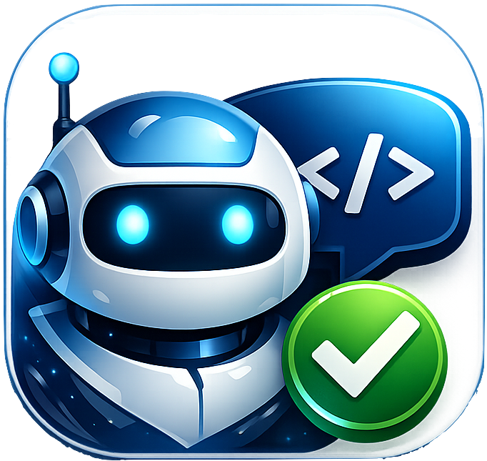
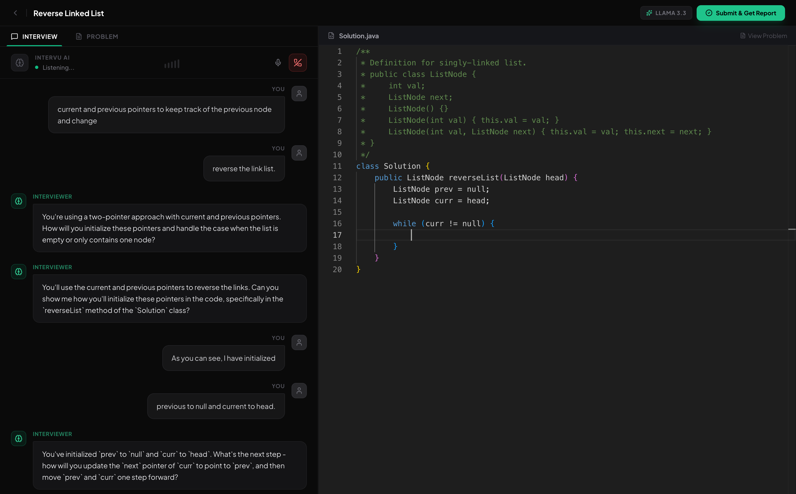
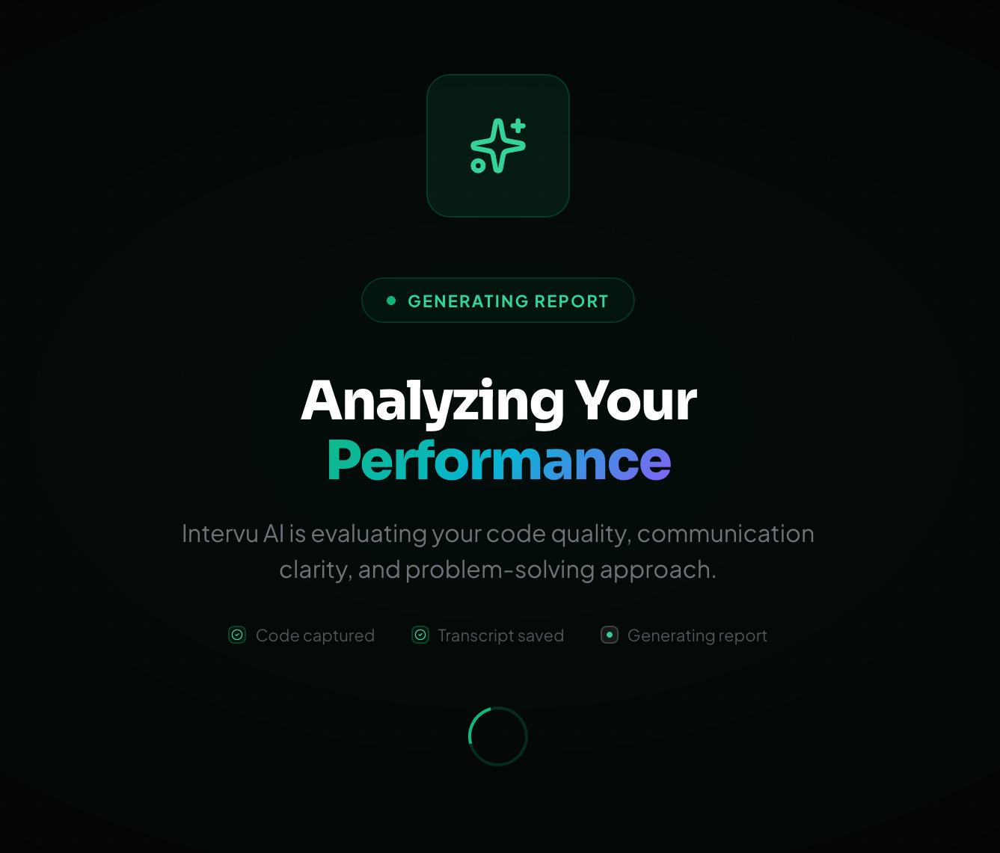
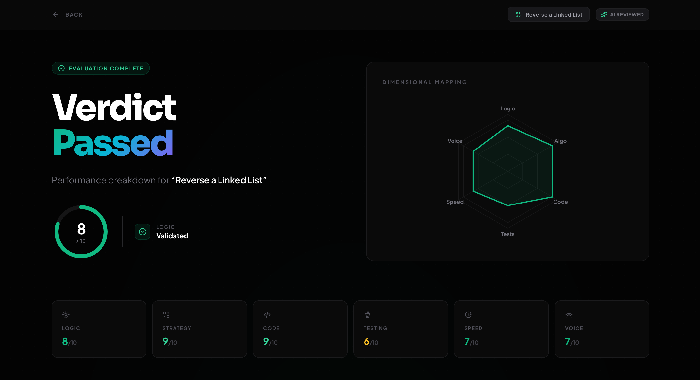
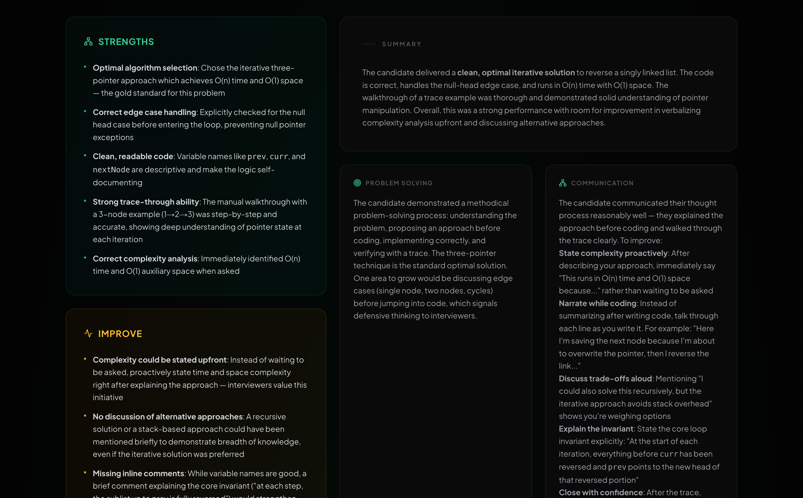
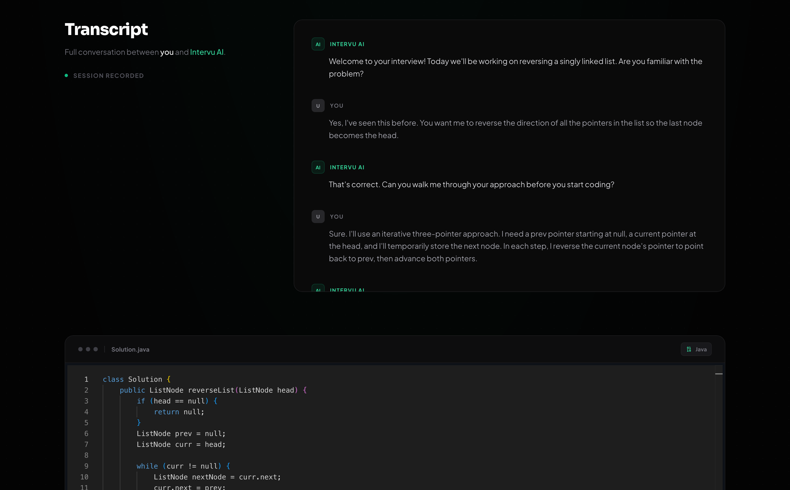
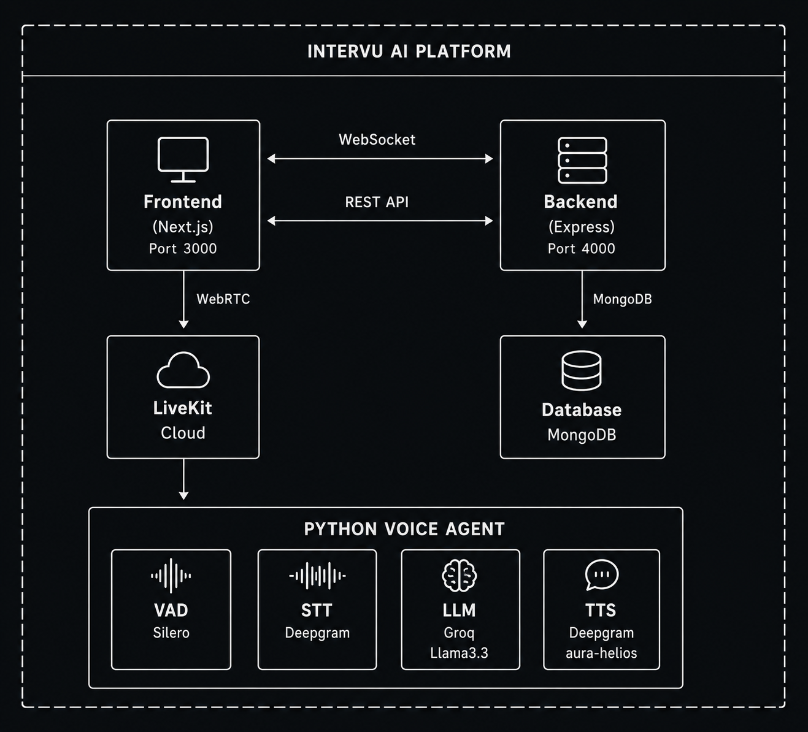

<h1 align="center">

Intervu AI
</h1>

<p align="center"><strong>Practice technical interviews with an AI that talks back.</strong></p>

<p align="center">
A voice-driven mock interview platform where an AI agent conducts realistic coding interviews: Complete with a live code editor, real-time conversation, and a forensic-style performance report at the end.
</p>

<p align="center">


</p>

https://github.com/user-attachments/assets/01a396c0-d9c2-4ec7-af7f-8c7209b9392c

> Watch the walkthrough above to see a full interview session from start to finish.

---

## How It Works

1. **Start a session** - The backend spins up an interview room and a LiveKit voice agent.
2. **Talk to the AI** - The agent greets you, walks through the problem, and asks follow-up questions in real time via voice.
3. **Write code** - A Monaco Editor is embedded right in the interview. The agent watches your code changes live and reacts - pointing out bugs, asking about edge cases, or nudging you when you're stuck.
4. **Get evaluated** - Once you're done (or say "I'm done"), the system generates a detailed performance report with per-dimension scores, code review, and transcript analysis.

The agent never hands you the answer. Instead, it asks guiding questions and lets you reason through the problem yourself.

---

## Features

### Voice-First Interview Experience

- **Real-time voice conversation** - The AI speaks and listens over WebRTC with sub-second latency, simulating a live interviewer
- **Natural speech detection** - Silero VAD identifies speech endpoints so the agent responds at the right moment - no cutting off mid-sentence
- **Professional AI voice** - Deepgram's aura-helios TTS produces clear, human-sounding speech with proper intonation
- **Hands-free control** - Say "I'm done" or "End the interview" to submit your session without touching a button

### Live Code Awareness

- **AI watches you code** - Every code change is streamed to the agent via data channels (500ms debounce), so the LLM always has the exact current state of your editor
- **Line-level feedback** - The agent references specific line numbers and variable names because it sees the actual code, not a guess
- **VS Code-quality editor** - Monaco Editor with syntax highlighting, bracket matching, and multi-language support (Java, JavaScript, Python, TypeScript, C++)
- **Resizable split layout** - Problem description on the left, code editor on the right - drag to adjust

### Forensic Performance Report

- **6-dimension scoring** - Evaluated on Logic, Strategy, Code, Testing, Speed, and Voice - each scored 1–10 and visualized on a radar chart
- **Evidence-based code review** - Every identified bug comes with the line number, what's wrong, and what the fix should be
- **Transcript forensics** - Exact quotes are pulled from the conversation to assess communication clarity, precision of terminology, and whether hints were ignored
- **Adaptive difficulty** - The agent decides whether to end the interview early (strong performance), ask a second question (mixed), or offer a different problem (struggled)
- **Deterministic evaluation** - Report generation uses a low temperature (0.3) so scores are consistent across repeated runs

---

## Getting Started

### Prerequisites

- Node.js 18+
- Python 3.8+
- MongoDB (local or Atlas connection string)
- API keys: [LiveKit Cloud](https://cloud.livekit.io/), [Groq](https://console.groq.com/), [Deepgram](https://console.deepgram.com/)

### Setup

```bash
git clone https://github.com/YOUR_USERNAME/intervu-ai.git
cd intervu-ai

# Backend
cd server && npm install

# Frontend
cd ../client && npm install

# Python agent
cd ../server/agent && pip install -r requirements.txt
```

### Environment Variables

Create three env files:

**`server/.env`**

```env
MONGODB_URI=mongodb://localhost:27017/intervu-ai
GROQ_API_KEY=
LIVEKIT_API_KEY=
LIVEKIT_API_SECRET=
LIVEKIT_URL=wss://your-project.livekit.cloud
PORT=4000
```

**`server/agent/.env`**

```env
LIVEKIT_URL=wss://your-project.livekit.cloud
LIVEKIT_API_KEY=
LIVEKIT_API_SECRET=
DEEPGRAM_API_KEY=
GROQ_API_KEY=
```

**`client/.env.local`**

```env
NEXT_PUBLIC_LIVEKIT_URL=wss://your-project.livekit.cloud
```

### Run

```bash
# From the project root - starts backend, frontend, and voice agent
python start.py
```

This launches all three services:

- Backend on port 4000
- Frontend on port 3000
- Voice agent connected to LiveKit

Logs are written to `backend.log`, `frontend.log`, and `agent.log` in the project root. The agent auto-restarts on crash. Press `Ctrl+C` to stop everything.

Open **http://localhost:3000** to start an interview.

---

## Screenshots

<table>
<tr>
<td width="50%"><strong>Live Interview Room</strong><br/></td>
<td width="50%"><strong>Analyzing Performance</strong><br/></td>
</tr>
<tr>
<td width="50%"><strong>Verdict & Scores</strong><br/></td>
<td width="50%"><strong>Detailed Feedback Report</strong><br/></td>
</tr>
<tr>
<td colspan="2"><strong>Transcript Generation</strong><br/></td>
</tr>
</table>

---

## System Architecture

<p align="center">

</p>

The platform is split into three services that communicate through well-defined protocols:

### Frontend (Next.js, Port 3000)

The browser-based UI where candidates interact. It renders the interview room, code editor, and results page. It connects to the backend over REST and WebSockets for session management, and directly to LiveKit Cloud via WebRTC for real-time audio.

### Backend (Express, Port 4000)

The central API server that handles session lifecycle - creating interviews, storing submissions, and triggering report generation. It persists all data in MongoDB and generates LiveKit access tokens so the frontend can join audio rooms.

### Voice Agent (Python, connected via LiveKit)

The AI interviewer lives here. It connects to LiveKit Cloud using the Agents SDK and runs a full voice pipeline:

- **Silero VAD** detects when the candidate is speaking vs. silent
- **Deepgram STT** (nova-2-general) transcribes speech to text in real time
- **Groq LLM** (Llama 3.3 70B) generates the agent's responses - asking questions, reacting to code, and guiding the interview
- **Deepgram TTS** (aura-helios) converts the LLM's output back to natural speech

Code changes from the frontend are sent over LiveKit data channels and injected into the agent's context on every keystroke, so the agent always knows the current state of the candidate's code.

---

## Tech Stack

| Layer           | What's Used                                                                            |
| --------------- | -------------------------------------------------------------------------------------- |
| **Frontend**    | Next.js 14, React, TypeScript, TailwindCSS, Monaco Editor, Recharts, LiveKit React SDK |
| **Backend**     | Express 5, TypeScript, MongoDB (Mongoose), LiveKit Server SDK, Groq SDK                |
| **Voice Agent** | Python, LiveKit Agents SDK, Deepgram (STT + TTS), Groq Llama 3.3 70B, Silero VAD       |
| **Real-time**   | LiveKit Cloud (WebRTC), Data Channels for code sync                                    |

---

## Report Generation

After an interview ends, the system runs a forensic analysis pass using Groq's LLM that produces:

- **Overall score** (1–10) with a pass/fail verdict
- **Six dimension scores**: Logic, Strategy, Code, Testing, Speed, Voice - visualized on a radar chart
- **Code review**: Line-by-line bug identification with suggested fixes
- **Transcript audit**: Quotes pulled from the conversation to evaluate communication clarity
- **Structured feedback**: Strengths, areas for improvement, problem-solving notes, and communication tips - all rendered as markdown

The report renders on a dedicated results page with a score donut, radar chart, and collapsible sections.

---

## Project Structure

```
├── client/                   # Next.js frontend
│   ├── app/
│   │   ├── page.tsx          # Landing page
│   │   └── interview/[id]/
│   │       ├── page.tsx      # Interview room
│   │       └── result/page.tsx # Performance report
│   ├── components/interview/
│   │   ├── InterviewRoom.tsx # Main interview orchestrator
│   │   ├── CodeEditor.tsx    # Monaco Editor wrapper
│   │   ├── VoiceComponent.tsx # Transcript + mic controls
│   │   └── LinkedListVisualization.tsx
│   └── components/CustomIcons.tsx
│
├── server/                   # Express backend
│   └── src/
│       ├── app.ts            # Entry point (port 4000)
│       ├── routes/interview.ts
│       ├── models/Session.ts # MongoDB schema
│       └── services/reportGenerator.ts
│
├── server/agent/             # Python voice agent
│   ├── agent.py              # LiveKit agent entrypoint
│   ├── deepgram_patch.py     # TTS compatibility layer
│   └── requirements.txt
│
├── start.py                  # One-command orchestrator
└── assets/screenshots/       # App screenshots
```

---

## API Endpoints

| Endpoint                | Method | Description                                          |
| ----------------------- | ------ | ---------------------------------------------------- |
| `/api/start`            | POST   | Create a new interview session with random questions |
| `/api/session/:id`      | GET    | Retrieve session state, transcript, and feedback     |
| `/api/submit`           | POST   | Submit code + transcript for evaluation              |
| `/api/submit-question`  | POST   | Submit current question and advance to next          |
| `/api/advance-question` | POST   | Agent-triggered question advancement                 |
| `/api/livekit/token`    | POST   | Generate a LiveKit access token                      |
| `/api/save-analysis`    | POST   | Agent saves the generated report                     |

---

## Agent Behavior

The voice agent follows a structured interview protocol:

1. **Greeting** - Introduces itself and states the problem
2. **Clarification** - Makes sure the candidate understands requirements
3. **Approach discussion** - Asks the candidate to explain their plan before coding
4. **Live observation** - Watches code changes in real time; only speaks when it detects bugs, approach shifts, or 60+ seconds of silence
5. **Wrap-up** - Reviews the solution, asks about time/space complexity and edge cases

### Context Injection

Code changes are streamed to the agent via LiveKit data channels with a 500ms debounce. The agent's system prompt is rebuilt each time so it always has the latest code state - preventing hallucinations about code the candidate never wrote.

### Adaptive Difficulty

Based on performance, the agent can:

- End the interview after one strong solution
- Advance to a second question for a more complete assessment
- Offer a different problem if the candidate struggled

---

## Roadmap

A fully interactive version of our engineering roadmap, including detailed technical specifications and a local progress tracker, is available at:
👉 **[plans.html](./plans.html)** (Open this file in any browser to trace phase details and check off features).

- [ ] Multi-language question bank (currently linked list reversal in Java)
- [ ] Concurrent session support (UUID-based session IDs)
- [ ] Redis-backed session caching
- [ ] User authentication and interview history
- [ ] Configurable difficulty levels
- [ ] Custom question upload

---

## License

[MIT](LICENSE)

---

## Author

Built with ❤️ by [Anshul Kumar](www.github.com/anshulhq).

If you find this useful, consider dropping a star.
